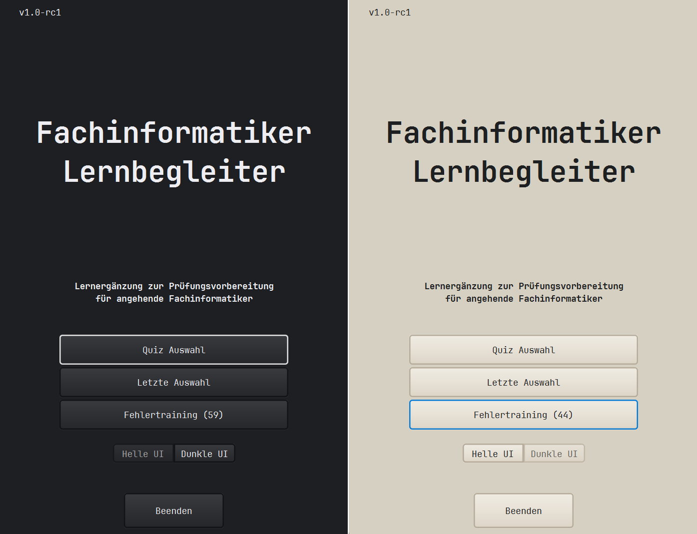

# Fachinformatiker Lernbegleiter (Desktop)

Eine Java-basierte Lern-App in Quizform für Windows zur ergänzenden Prüfungsvorbereitung für angehende Fachinformatikerinnen und Fachinformatiker, insbesondere für AP1 und perspektivisch AP2. Die Fragen werden JSON-/Gson-basiert geladen und verarbeitet.

Die Desktop-Version nutzt JavaFX mit FXML, übernimmt die Java-Kernlogik der Android-Version und speichert Lernstand sowie Fehlertraining lokal über SQLite. Benutzereinstellungen wie Custom Light-/Dark-Mode und „Letzte Auswahl“ werden lokal gespeichert.

**Hinweis:** Diese App ist kein offizielles Angebot der IHK, einer Berufsschule oder einer vergleichbaren Institution. Es handelt sich um ein privates Lern- und Entwicklungsprojekt. Die enthaltenen Fragen sind keine offiziellen IHK-Prüfungsaufgaben und ersetzen keine offiziellen Lern- oder Prüfungsmaterialien.

[**Desktop ZIP/EXE (v1.0-rc1)**](https://github.com/devake86/Fachinformatiker-Lernbegleiter-desktop/releases/download/v1.0-rc1/FiLb-desktop_v1.0-rc1.zip)

---

## Screenshots

Vorschau des Desktop-Hauptmenüs in Dark- und Light-Mode:

UI/UX Vorschau anzeigen

*Desktop-Hauptmenü in Dark- und Light-Mode mit Schnellzugriffen auf „Quiz Auswahl“, „Letzte Auswahl“ und „Fehlertraining“. (v1.0-rc1).*

---

## Status

Aktuelle Version: **v1.0-rc1**

Status: **Release Candidate / Betatest**

Zielplattform:
- Windows-Desktop-App (`.exe` / `.zip`)

Lokal ausführen:
- JDK 21 oder kompatibel erforderlich
- Start über: `./gradlew run`

---

## Projektübersicht

Dieses Projekt wurde als ergänzendes Lernwerkzeug während der Umschulung zum Fachinformatiker entwickelt.

Diese Anwendung ist das Desktop-Gegenstück zur Android-Version des Fachinformatiker Lernbegleiters.

Motivation:
- Java- und OOP-Konzepte wurden in den offiziellen Lernfeldern nur begrenzt vertieft.
- Es bestand Bedarf an einer effizienten und interaktiven Lernmöglichkeit als Ergänzung zu langsameren Lernmethoden wie Büchern oder Karteikarten.
- Neben mobiler Nutzung sollte auch eine Desktop-Version verfügbar sein, die in einem kleinen Fenster neben anderen Aufgaben verwendet werden kann.

Lösung:
- Desktop-Lernanwendung für Windows
- Android-ähnliches Fensterformat mit festem App-Panel
- Nutzbar im kleinen Fenster oder Snap-Layout neben anderen Aufgaben
- Kurze Lernrunden und schnelle Wiederholung
- JSON-basierte Fragenpakete
- Wiederverwendbare Java-Kernlogik und ähnliche Projektstruktur für mehrere Plattformen
- Android- und Desktop-Version werden möglichst parallel weiterentwickelt

---

## Aktueller Funktionsstand

- Überarbeiteter Fragenablauf für bessere UI/UX:
  - Jede Frage läuft auf einem Screen ab.
  - Antwort auswählen → gewählte Antwort wird hervorgehoben.
  - Bestätigen-Button erscheint.
  - Nach Bestätigung werden richtige/falsche Antworten markiert.
  - Erklärung wird zwischen Frage und Antwortbereich angezeigt.
  - Der Button wechselt zu „Nächste Frage“ oder „Quiz auswerten“.
- Antwortfeedback wurde dezenter gestaltet:
  - Antworten bleiben optisch neutral.
  - Richtig/falsch wird über farbige Rahmen und Marker angezeigt.
  - Marker bleiben als deutliche visuelle Unterstützung erhalten.
- Fragetyp aktuell:
  - 1-aus-4-Fragen
  - negierte 1-aus-4-Fragen
  - Wahr/Falsch-Logik ist vorbereitet, wird aktuell aber bewusst nicht genutzt, da 1-aus-4-Fragen didaktisch sinnvoller für die Lernziele sind.
- AP1-Modus:
  - gewichtete Lernfeldmischung aus LF 01–06
  - aktuell auf 36 Fragen pro AP1-Runde ausgelegt
- Lernfeld-Vertiefung:
  - 20-Fragen-Modus für einzelne Lernfelder
  - Round-Robin-Auswahl aus Unterthemen
  - Fragenpakete für Sachfragen, Fachbegriffe und Abkürzungen
  - Zusätzliche Fragenpakete wie Code-Snippets oder Subnetting für passende Lernfelder
- Fragenbestand LF 01–06 für RC1 überarbeitet:
  - Fachbegriffe, Sachfragen und thematische Fragenpakete wurden systematisch geprüft.
  - Distraktoren wurden plausibler, fachnäher und weniger offensichtlich formuliert.
  - Frageformate wurden stärker vereinheitlicht, damit Antwortlängen, Stil und Schwierigkeitsgrad konsistenter wirken.
- Lokale SQLite-basierte Lernstandsspeicherung:
  - Richtig beantwortete Fragen werden über ihre eindeutige Fragen-ID gespeichert und aus neuen normalen Quizrunden herausgefiltert.
  - Falsch beantwortete Fragen werden persistent gespeichert und können über „Fehlertraining (x)“ im Hauptmenü erneut geübt werden.
  - Korrekt beantwortete Fehlerfragen werden automatisch aus dem persistenten Fehlerfragenpool entfernt.
  - Der Lernstand bleibt nach Programmende und Neustart erhalten.
- Reset-Dialog für abgeschlossene Auswahlen:
  - Wenn für eine Auswahl nicht mehr genug offene Fragen verfügbar sind, kann der Nutzer die korrekt beantworteten Fragen dieser Auswahl zurücksetzen und direkt neu starten.
  - Falsch beantwortete Fragen bleiben beim Zurücksetzen korrekt beantworteter Fragen erhalten.
- Lokaler Wiederholungspool innerhalb einer laufenden Quizrunde:
  - Falsch beantwortete Fragen können zusätzlich direkt am Ende einer Quizrunde erneut wiederholt werden.
  - Dieser lokale Wiederholungspool ergänzt das persistente Fehlertraining.
- Session-basierter Fragenpool innerhalb aktiver Runden:
  - Bereits gezogene Fragen werden innerhalb einer laufenden Auswahl reduziert.
  - Neue Runden über „Neue Runde“ greifen weiterhin auf den verbliebenen Fragenpool der aktuellen Auswahl zu.
- Hauptmenü mit Schnellzugriffen:
  - „Quiz Auswahl“ für neue AP1- oder Lernfeld-Auswahl
  - „Letzte Auswahl“ für schnellen Wiedereinstieg
  - „Fehlertraining (x)“ für persistent gespeicherte falsch beantwortete Fragen
- Fragen-ID kann kopiert werden, um fehlerhafte Fragen leichter zu melden oder zu korrigieren.
- Light- und Dark-Mode
- JavaFX-/FXML-Oberfläche mit CSS-Theme
- Desktop-App bleibt als zentriertes 560×860-App-Panel stabil, auch wenn das Fenster größer ist.
- Hauptmenü und Quizauswahl wurden für feste Buttonpositionen und schnelle Wiedereinstiege optimiert
- JetBrains Mono als Schriftart für technische Optik und sauber ausgerichtete Code-Snippets
- Creator-Easter-Egg

Bewusste Designentscheidungen:
- Ein Bestätigungsschritt bleibt erhalten, damit nach der Antwortauswahl bewusst bestätigt werden muss und unbeabsichtigte Eingaben vermieden werden. Diese Entscheidung wurde durch Nutzerfeedback bestätigt.
- Bildfragen wurden vorerst bewusst nicht priorisiert, da Skalierung und Nutzen im aktuellen Lernkonzept nicht im Vordergrund stehen.
- Diagramm- und Excel-Aufgaben werden später eher theoretisch oder über andere Lernformen berücksichtigt.
- Code-Snippet-Fragen können über JSON-Fragen sauber abgebildet werden.
- Desktop-Buttons dürfen breiter und luftiger sein als in der Android-Version, um abgeschnittene Texte zu vermeiden.

---

## Ziele

### Mindestziele

- AP1-Modus:
  - kombiniert Lernfelder 01–06
  - gewichtete Fragenanzahl abhängig von der Dauer der Lernfeldbehandlung
  - aktuell 36 Fragen pro AP1-Runde

- Lernfeld-Vertiefung:
  - 20-Fragen-Modus für einzelne Lernfelder
  - Sachfragen, Fachbegriffe und Abkürzungen pro Lernfeld ausbauen
  - Code-Snippet- und Subnetting-Fragen dort ergänzen, wo sie fachlich sinnvoll sind
  - scrollbare Auswahlmenüs für Lernfelder und Fragenpakete

- Feedback aus Testphasen einarbeiten

---

### Optionale Ziele

- AP2-Modus für Lernfelder 01–12
  - perspektivisch für FIAE und FISI
  - nur falls zeitlich sinnvoll umsetzbar, da deutlich höherer Content-Aufwand

---

## Lernziele des Projekts

- OOP-Verständnis verbessern
- Java-Wissen praktisch anwenden und vertiefen
- JavaFX- und FXML-GUI-Entwicklung kennenlernen
- UI/UX für Desktop-Anwendungen besser verstehen
- Mit JSON-Datenstrukturen arbeiten
- Ein praktisch nutzbares Lernwerkzeug für echte Prüfungsvorbereitung bauen
- Plattformübergreifende Projektstruktur aufbauen und pflegen
- Lokale Persistenz mit SQLite/JDBC umsetzen

---

## Roadmap

### Priorität 1 – RC1 / Betatest

- Android- und Desktop-Version mit Testpersonen prüfen
- Persistente Lernstandslogik und Fehlertraining im praktischen Einsatz testen
- UI/UX-Feedback sammeln
- Fehlerhafte oder unklare Fragen korrigieren
- Fragenbestand für LF 01–06 prüfen und ergänzen
- README und Screenshots aktualisieren

### Priorität 2 – Content-Ausbau

- Mehr hochwertige prüfungsnahe Fragen für LF 01–06 ergänzen
- AP1-Fragenmischung weiter verbessern
- Sachfragen, Fachbegriffe und Abkürzungen pro Lernfeld ausbauen
- Code-Snippet- und Subnetting-Fragen dort ergänzen, wo sie fachlich sinnvoll sind

### Priorität 3 – Web-/PWA-Port

- TypeScript-basierter Web-/PWA-Port auf Grundlage der RC1-Logik
- Android-ähnliche UI/UX für mobile Browser und iOS-Geräte
- Offline-first-Ansatz mit installierbarer PWA
- Kein Tracking, keine Telemetrie und kein Online-Zwang
- Automatische Updates können genutzt werden, wenn der Nutzer online ist und eine neue Version erkannt wird

### Post-RC1 / Post-1.0-Ideen

- Fortlaufende Überarbeitung und Verschärfung des Fragenbestands:
  - präzisere Formulierungen
  - plausiblere Distraktoren
  - zusätzliche prüfungsnahe Fragen
- Weitere Bugfixes und UI-Feinschliff auf Basis eigener Nutzung und Betatests
- Technische Refactorings:
  - gemeinsame Dialog-Erzeugung auslagern
  - ähnliche TextFlow-/Beschreibungsmethoden zusammenführen
  - JSON-Pfade in einem zentralen Fragenkatalog bündeln
  - Quiz-Vorbereitungslogik aus den Controllern auslagern
- Erweiterte Lernlogik:
  - optionale Spaced-Repetition-Ansätze
  - feinere Logik für das Entfernen oder Wiederholen falscher Fragen, z. B. Priorisierung von oft falsch beantworteten Fragen
  - optionale Statistiken zu Lernfortschritt und Fehlerhäufigkeit
- Persistenz-Ausbau:
  - Android perspektivisch mit Room statt direktem SQLite-Zugriff
  - optionale Import-/Export-Funktion für Lernstände
  - Web/PWA perspektivisch mit localStorage oder IndexedDB
- mögliche spätere AP2-Erweiterung

---

## Changelog

### v1.0-rc1 (Android & Desktop)

Implementiert:

- Projektname auf **Fachinformatiker Lernbegleiter** festgelegt; der Fokus bleibt eine plattformübergreifende ergänzende Lern-App zur Prüfungsvorbereitung.
- UI/UX deutlich näher zwischen Android- und Desktop-Version angeglichen
- Desktop-Hauptmenü mit festen Schnellzugriffen für Quiz Auswahl, Letzte Auswahl und Fehlertraining überarbeitet
- Hauptmenü überarbeitet:
  - neue „Quiz Auswahl“ als eigenes Zwischenmenü
  - Schnellzugriffe für „Letzte Auswahl“ und „Fehlertraining (x)“
  - stabilere Buttonpositionen durch reservierte UI-Bereiche
- Android-Version um eine Auswahl für linkshändige Daumennutzung erweitert, inklusive angepasster UI-Elemente im Quizablauf und in Dialogfenstern
- Light- und Dark-Theme überarbeitet
- dezenteres Antwortfeedback:
  - neutraler Buttonhintergrund
  - farbiger Rahmen für richtig/falsch
  - farbige Marker als Zusatzsignal
- Selected-/Pressed-/Hover-Zustände überarbeitet
- Antwortmarker optisch angepasst
- AP1-Modus mit gewichteter LF01–LF06-Fragenmischung
- Quiz-Auswahlmenü, Content-Menü und Content-Submenü für AP1-, Lernfeld- und Fragenpaketauswahl
- Lernfeld-Vertiefung mit 20-Fragen-Modus
- „Letzte Auswahl“-Funktion
- Persistentes Fehlertraining über lokale SQLite-Datenbank::
  - falsch beantwortete Fragen werden über ihre Fragen-ID gespeichert
  - korrekt beantwortete Fehlerfragen werden automatisch aus dem Fehlerfragenpool entfernt
  - Hauptmenü zeigt die aktuelle Anzahl offener Fehlerfragen als „Fehlertraining (x)“
  - Fehlerfragen bleiben nach App-/Programmneustart erhalten
- Kopierfunktion für Fragen-ID
- Optionales Wiederholen falsch beantworteter Fragen:
  - lokaler Wiederholungspool für falsche Fragen innerhalb der aktuellen Quizrunde
  - persistentes Fehlertraining für falsch beantwortete Fragen aus allen bekannten Fragenpaketen
- Kombination aus lokalem Session-Fragenpool und persistenter SQLite-Lernstandsspeicherung zur Reduktion direkter Wiederholungen
- Reset-Dialog für abgeschlossene Auswahlen:
  - korrekt beantwortete Fragen einer Auswahl können zurückgesetzt und direkt neu gestartet werden
  - falsch beantwortete Fragen bleiben dabei erhalten
- Desktop-Version auf festes 560×860-App-Panel mit zentrierter Darstellung umgestellt
- Creator-Easter-Egg
- Code-Cleanup und bessere Methodenstruktur in den Hauptklassen
- Fragenbestand LF 01–06 umfassend für RC1 geprüft und überarbeitet:
  - Distraktoren wurden fachnäher und plausibler formuliert.
  - Offensichtliche Falschantworten wurden reduziert.
  - Antwortlängen und Formulierungsstil wurden stärker vereinheitlicht.
  - Fachbegriffe und Sachfragen können sich thematisch überschneiden, bleiben aber wegen getrennter Lernmodi bewusst erhalten.

Bekannte Einschränkungen:

- Fragenbestand wird weiter ausgebaut.
- Der Fragenbestand wurde für RC1 erstmals umfassend qualitativ geprüft und überarbeitet. Einzelne Frageformulierungen, Distraktoren oder Dopplungen zwischen getrennten Modi können sich durch Betatests und Selbstfeedback weiter ändern.
- AP2-Modus ist noch nicht umgesetzt.
- Einfache persistente Lernstandspeicherung inklusive Fehlertraining ist umgesetzt; erweiterte Lernlogik wie Spaced Repetition, Statistiken oder Import-/Export-Funktionen ist noch nicht enthalten.
- Web-/PWA-Port ist geplant, aber noch nicht Bestandteil dieses RC1.

---

### v1.0-beta2 (Desktop & Android)

Implementiert:

- Gradle als Build-Tool für den Desktop-Port zur besseren Konsistenz mit der Android-Version
- JavaFX-Desktop-Port auf FXML umgestellt
- Hauptmenü und Quizflow im Desktop-Port getrennt
- Sofortiges visuelles Feedback auf Antwortbuttons
- separaten Zwischenergebnis-Screen nach jeder Antwort entfernt
- Session-State gegen zu schnelle Wiederholungen innerhalb laufender Runden
- AP1-Modus mit JSON-basierter Fragenlogik
- kleines Creator-Easter-Egg

Designentscheidung:

- Bestätigungsbutton beibehalten, um versehentliche Antworten zu vermeiden.

---

### v1.0-beta (Desktop & Android)

- GUI-Versionen für Desktop (JavaFX) und Android umgesetzt
- Android-Version trennt bereits Menü- und Quizflow
- Windows-Desktop-Build (`.exe`) erstellt
- Android-Debug-Build (`.apk`) erstellt

User Testing:

- Mit Mitschülern getestet
- Insgesamt positives Feedback
- UI-Verbesserungen gewünscht

---

### v0.1-prototype (Desktop)

- Kernklassen für das Quiz implementiert
- JSON-Struktur und Loader erstellt
- Quizlogik in Engine umgesetzt
- einfache Konsolenausgabe zum Testen in der Main-Klasse

---

## Lizenz

Dieses Projekt ist als privates Lern- und Referenzprojekt entstanden.
Lizenzinformationen siehe Repository.
