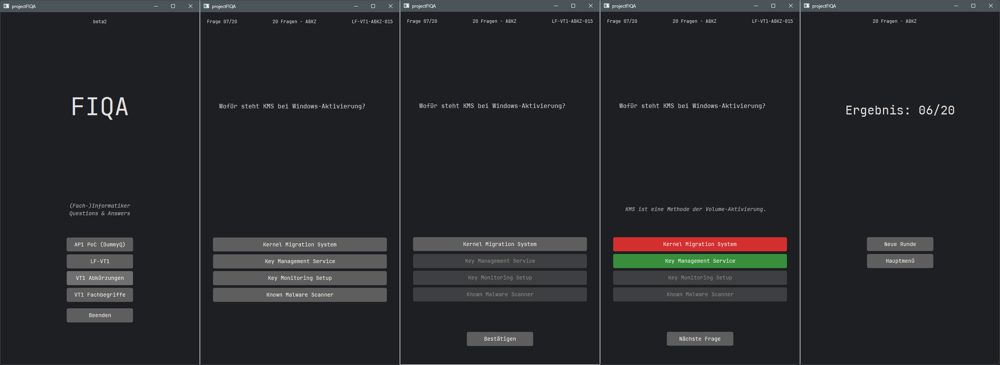

# projectFIQA (Desktop)

[**Desktop EXE (v1.0-beta2)**](https://github.com/devake86/projectFIQA-desktop/releases/download/v1.0-beta2/projectFIQA-desktop_v1-beta2a.zip) A Desktop version of the Android App as an alternative for iOS users to prepare for the IHK FISI/FIAE final exams (AP1 / AP2) with JSON-/Gson-based question handling. Reuses the Java Core-logic of the Android App and uses JavaFX (FXML) to build the UI.

---

## Screenshots

Preview of the UI Flow:

*Example the UI Flow from Main menu to Resultscreen (v1.0-beta2)*

---

## Status
Current version: v1.0-dev2

Last stable release: v1.0-beta2

Designed for Windows (.exe).

To run locally:
- Requires JDK 21 (or compatible)
- Run with `./gradlew run`

---

## Project Overview

This project was created as an additional learning tool during retraining as a *Fachinformatiker*.

This application is the desktop counterpart of the projectFIQA android version.

Motivation:
- Java and OOP concepts were not deeply covered in the official learning fields
- Need for a more mobile, efficient and interactive way of learning to replace slow and bulky "book-learning" methods or handling flashcards on the go
- Convert daily "dead travel time" during commutes into a practical exam preparation while ensuring privacy in crowded public transport

Solution:
- A desktop learning application for Windows
- Designed to run in an Android-like window or in a small “snap” window next to other tasks
- Allows easy repetition and quick learning sessions
- Reusable Java Core-logic and structure for use on different platforms

---

## Current Status

- Reworked the question loop for a better UI and UX:
  - Every question loop is now on one screen. choose answer button (chosen answer is highlighted; rest has lower opacity) -> confirmation button pops up -> by pressing the confirmation button the answer button turns green if correct answer is given or red for wrong answer and the correct answer turn greens (the rest stays at lower opacity) -> explanation pops up between the question text and the answer buttons -> confirmation button changes text and leads to next question or quiz evaluation if it is the last question of the round.
  - Ommited potential questions with pictures due to not beeing used much if at all and potential scaling problem for little outcome; diagramms and excel questions are better learned through different means but theoretical questions will still be used; code snippet questions can be properly implemented via JSONs.
  - Changed the overall font to JetBrainsMono to support perfectly aligned JSON code snippet indents and give the app a more techy vibe.
- Working core-logic for AP1 mode (for now, Proof of Concept with Dummy-questions)
- Working “20 Questions Mode” for either mixed questions, abbreviations and technical terms mode.
- Question format: 1 out of 4 questions and negated 1 out of 4 questions to simulate multiple choice while not requiring more complex logic to achieve a similar outcome (ommited True/False questions as they are not as beneficial for learning purposes as 1 out of 4 questions, but kept the code in for now)
- Implemented a Session-State to combat repeat questions as long as new round are played through "Neue Runde" in the result screen instead of "Track correctly answered questions using IDs and timestamps" and "Reintroduce questions into the pool after 2–3 days (learning curve)" as a simple solution based on daily use cases (only a couple of round per day).
- Includes an answer confirmation step to prevent accidental selections and improve usability.

- The desktop version uses a custom CSS styling to visually match the Android dark mode design.
- Improved the parity with the android version for the desktop version through separating the main menu from the quiz flow

---

## Goals

### Minimum Goals

- Implement an AP1 mode:
  - Combines all topics from learning fields 1–6 with a weighted question count for each depending on the number of weeks each learning field was taught times three for 36 questions total which is the average question amount of a typical learning objective verification.

- Add repetition mode:
  - 20 Questions Mode for individual learning fields with a mixed questions, abbreviations and technical terms mode.
  - Add a scrollable selection screen for the different learning field modes after choosing "20 Fragen"

- Integrate user feedback from testing phases

---

### Optional Goals

- AP2 mode (learning fields 1–12)
  - intended for both FIAE and FISI tracks
  - only if time permits (significantly higher workload)

---

## Learning Objectives

- Improve understanding of OOP
- Deepen and apply Java knowledge in real-world scenario
- Learn JavaFX (FXML) GUI development
- Work with JSON data structures
- Build a practical, usable learning tool for real exam preparation
- Maintain cross-platform project structure

---

## Changelog

### v1.0-dev2 (desktop & android)

TODO:

Priority (based on user feedback):
- Optional repetition of incorrectly answered questions after a round

General:
- Add at least 40 high-quality exam-oriented questions per topic LF1-9 to have at least 2 rounds of 20 Questions and 4 rounds of AP1 Mode for a v1.0-mvp-release
- Add a scrollable submenu for all topics for at least the mixed questions mode

If time:
- If time add soft hyphens for json questions and explanations for a smoother text line break
- If time make it so the first scrollable submenu button starts at the height where the first answer button would be through autoscroll implementation to improve onehanded thumb navigation but overall the menu should use the whole screen
- If time add abbreviations and technical terms mode for every topic with at least 40 questions
- If time add extend mechanic to the LF buttons in the submenu to open up a choice between buttons for mixed questions, abbreviations and technical terms mode per LF.
- If time add a copy function for the question id in the status bar
- If time make android version a fixed vertical mode only (no landscape mode)

Future considerations:
- Consider adding statistics / correctness percentage display

---

### v1.0-beta2 (desktop & android)

IMPLEMENTED:

- Gradle as build tool for Desktop Port to ensure consistency with the Android Version
- Refactored the JavaFX Desktop Port to use FXML to ensure consistency with the Android Version
- Separated the main menu of the Desktop Port from the quiz flow for better parity with the Android Version
- Immediate feedback on answer buttons (green/red)
- Remove extra result screen after answering
- Implemented a Session-State to combat repeat questions as long as new round are played through "Neue Runde" in the result screen
- Implement AP1 mode with JSON-based question logic

- Added a small creator easter egg

Design decisions:
- Kept answer confirmation button to prevent accidental selections (based on user feedback)

---

### v1.0-beta (desktop & android)

- Implemented GUI versions for Desktop (JavaFX) and Android
- Android version already separates menu and quiz flow
- Created Windows desktop build (.exe)
- Created Android debug build (.apk)

User testing:
- Tested with classmates (learning field 9 questions)
- Overall positive feedback
- UI improvements requested

---

### v0.1-prototype (desktop)

- Implemented core quiz classes
- Created JSON structure and loader
- Implemented quiz logic in engine
- Basic console output for testing in main class
